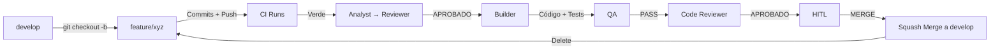

# Git Workflows — gi-ot (AI-NATIVE)

## Ramas

### main
- **Propósito**: Releases de producción únicamente
- **Protección**: Branch protection + Ruleset
- **Merge**: Solo via PR desde `develop` (release PR)
- **Tags**: `v<major>.<minor>.<patch>` en merge

### develop
- **Propósito**: Rama de integración continua
- **Protección**: Branch protection + Ruleset
- **Merge**: Solo via PR desde `feature/*` o `hotfix/*`
- **Nunca**: Commit directo, force push, rebase

### feature/<nombre>
- **Origen**: `develop` (actualizado antes de crear)
- **Vida**: Una feature/milestone
- **Naming**: `feature/<kebab-case-descriptivo>`
  - Ej: `feature/validacion-postgresql`, `feature/portal-clientes`
- **Commits**: Atómicos, mensajes en español, conventional commits opcional
- **Push**: Frecuente (backup, CI)
- **Merge**: Squash a `develop` tras HITL
- **Delete**: Tras merge

### hotfix/<nombre>
- **Origen**: `main` (tag de release)
- **Vida**: Corrección crítica en producción
- **Naming**: `hotfix/<kebab-case-descriptivo>`
- **Merge**: PR a `main` Y PR a `develop` (backport)
- **Delete**: Tras ambos merges

## Flujo estándar (Feature)



## Comandos estándar

### Iniciar feature
```bash
git checkout develop
git pull origin develop
git checkout -b feature/nombre-descriptivo
```

### Trabajar
```bash
# Cambios...
git add -p
git commit -m "feat: descripción clara en español"
git push origin feature/nombre-descriptivo
```

### Sync con develop (si necesario)
```bash
git fetch origin
git merge origin/develop  # NO rebase
```

### Finalizar (tras HITL MERGE)
```bash
git checkout develop
git pull origin develop
git branch -d feature/nombre-descriptivo
git push origin --delete feature/nombre-descriptivo
```

## Convenciones de commit

### Formato
```
<tipo>(<ámbito>): <descripción en español>

[body opcional]

[footer opcional]
```

### Tipos
- `feat` — Nueva funcionalidad
- `fix` — Corrección de bug
- `refactor` — Refactor sin cambio funcional
- `perf` — Mejora de performance
- `docs` — Documentación
- `test` — Tests
- `chore` — Mantenimiento (deps, config, CI)
- `build` — Build system, deps
- `ci` — CI/CD
- `security` — Seguridad

### Ejemplos
```
feat(api): agregar endpoint branding tenant
fix(ui): corregir contraste botones modo oscuro
refactor(service): extraer lógica validación tenant
test(api): agregar tests multitenancy receipts
chore(deps): actualizar pytest a 9.x
```

## Pull Request Template

### Título
`<tipo>: <descripción>` (ej: `feat: comprobantes y comunicaciones §09`)

### Body obligatorio
```markdown
## Resumen
<2-3 líneas qué hace este PR>

## Feature
- runs/<feature>/spec.md
- runs/<feature>/analysis.md
- runs/<feature>/review.md
- runs/<feature>/build.md
- runs/<feature>/qa.md
- runs/<feature>/codereview.md
- runs/<feature>/hitl.md

## Cambios principales
- `apps/api/...` — <qué>
- `apps/web/...` — <qué>
- `alembic/...` — <migración>
- `tests/...` — <cobertura>

## Validaciones
- [ ] `ruff check .` — PASS
- [ ] `mypy .` — PASS
- [ ] `pytest -q` — PASS (suite completa)
- [ ] `alembic upgrade head` — PASS
- [ ] Frontend: `npm run lint/typecheck/build` — PASS

## Checklist pre-merge
- [ ] Tests pasando localmente
- [ ] CI verde en PR
- [ ] Code Reviewer APROBADO
- [ ] HITL MERGE autorizado
- [ ] No breaking changes no documentados
- [ ] Migraciones reversibles probadas
- [ ] Docs actualizadas
```

## CI/CD Integration

### En PR (GitHub Actions)
1. `ci.yml` ejecuta validaciones
2. Resultados publicados como checks
3. Code Reviewer usa checks como evidencia
4. HITL ve checks verdes como requisito

### Post-merge a develop
1. Deploy automático a staging (si configurado)
2. Tests de humo en staging
3. Notificación a equipo

### Release (PR develop → main)
1. `release.yml` genera changelog
2. Tag `vX.Y.Z`
3. Deploy a producción (manual o auto)

## Protecciones de rama (GitHub)

### develop
```yaml
protection_rules:
  - required_pull_request_reviews:
      required_approving_review_count: 1
      dismiss_stale_reviews: true
      require_code_owner_reviews: false
  - required_status_checks:
      strict: true
      contexts:
        - "ci/lint"
        - "ci/tests-backend"
        - "ci/tests-frontend"
        - "ci/build"
  - enforce_admins: true
  - restrictions:
      users: []
      teams: [maintainers]
```

### main
```yaml
protection_rules:
  - required_pull_request_reviews:
      required_approving_review_count: 2
      dismiss_stale_reviews: true
  - required_status_checks:
      strict: true
      contexts:
        - "ci/lint"
        - "ci/tests-backend"
        - "ci/tests-frontend"
        - "ci/build"
        - "ci/release-validation"
  - enforce_admins: true
  - restrictions: {}
```

## Reglas de oro

1. **Nunca** commit directo a `develop` o `main`
2. **Nunca** force push a ramas protegidas
3. **Nunca** merge sin PR
4. **Nunca** merge sin CI verde
5. **Nunca** merge sin HITL
6. **Siempre** squash merge (historial limpio)
7. **Siempre** delete feature branch tras merge
8. **Siempre** mensajes en español
9. **Siempre** `runs/<feature>/` completo antes de PR